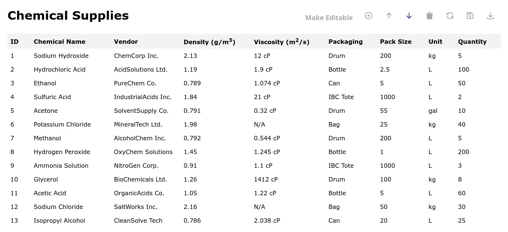

# Chemical Supplies table

It is PWA (progressive web app) Interactive Chemical Supplies table that contains a list of chemicals with their details. It also has sort options on each column based on which user can sort the data. The left top toolbar contains the functionality to add the row, move row down, move row up, delete row, refresh the data and save the data.

This project is part of VLabs IIT Bombay Challenge for JS programmer position

[Link to challenge](https://docs.google.com/document/d/1TH_tmLRZFlg5Jsa55P-wxrn4krsXt0JLZG8GmYoZeGA/pub)

# Demo

[Visit](https://parthvyas7.github.io/chemical-supplies-table/)

## Screenshots

# Design Approach

See [DESIGN.md](/DESIGN.md)

## License

[MIT](https://choosealicense.com/licenses/mit/)

